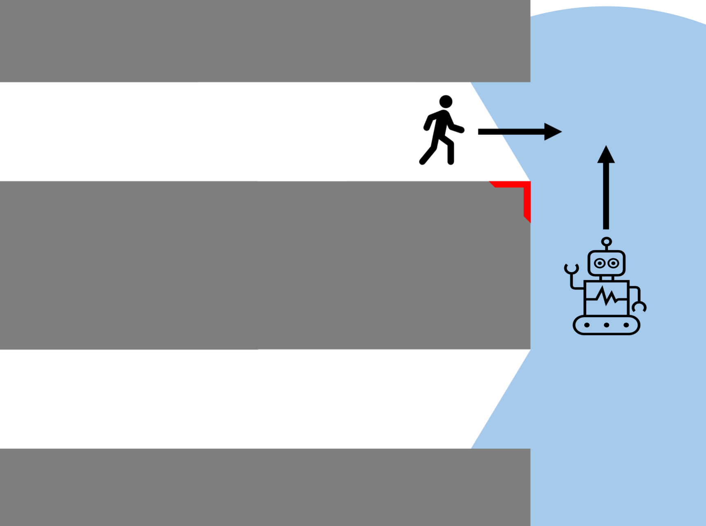
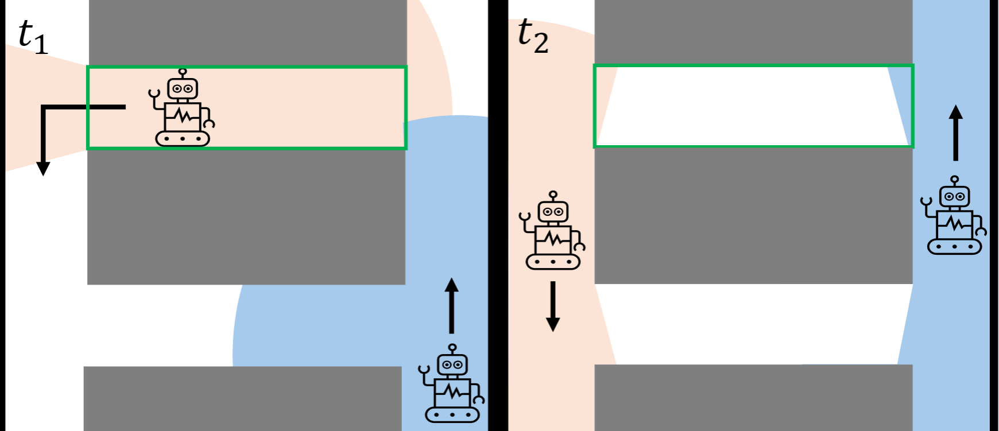
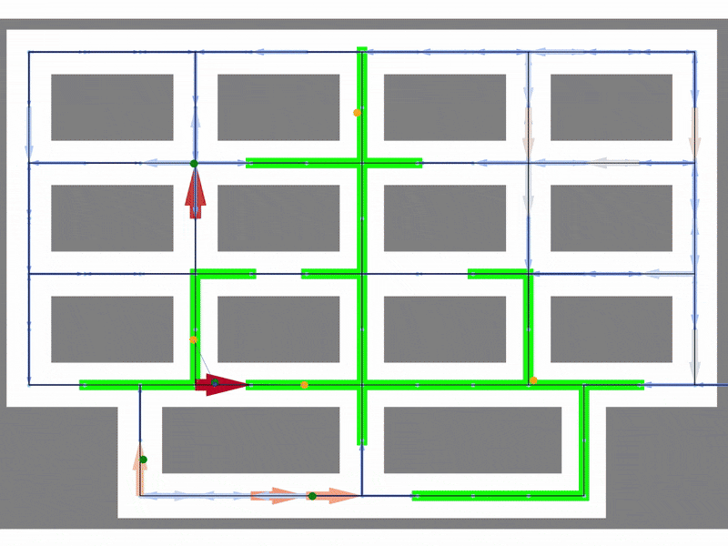

# Graph-particle-filter

A graph-based particle filter for tracking humans in warehouse environments using Autonomous Mobile Robot (AMR) perceptions. This approach specifically addresses the "blind corner problem" by enabling predictions about human locations even when they're not directly visible to any robot.

## The Blind Corner Problem

In modern warehouses, AMRs operate alongside human workers, creating safety challenges. AMRs must reduce their speed at "blind corners" - areas where humans might suddenly appear from behind obstacles without prior detection. This speed reduction significantly impacts system efficiency, but is necessary for safety.

Traditional solutions to this problem typically involve installing additional hardware like fixed sensors at blind corners or using passive reflectors. This approach instead focuses on using existing AMR sensor data more intelligently.



## The Approach

This project implements a novel graph-based particle filter that:

1. Combines perceptions from all AMRs in the warehouse to track humans collaboratively
2. Leverages the topological structure of warehouse aisles to constrain possible human movements
3. Uses probabilistic prediction to model human movement patterns, even when people are temporarily unobserved

The core concept is illustrated by a simple example visualized below: 
The upper AMR observes that the green boxed aisle is empty at time t₁. Then the two AMRs continuously monitor both entrances to the green boxed aisle. 
At time t₂ they can jointly determine that no human could have entered the aisle undetected. This allows the second AMR to maintain speed when passing the blind corner, even though it cannot directly see into the green boxed aisle.



The probabilistic motion model also accounts for human walking speeds and typical movement patterns. This means that if a person enters an aisle, the system can predict when they might emerge from the other end based on realistic movement patterns, creating a time-dependent probability distribution of possible human locations.

Unlike approaches requiring additional hardware installations, this method works with existing AMR sensors, requiring only wireless communication between robots and a central processing unit to share and combine perception data.

The gif below shows the particle filter in action. Humans are displayed by green dots, AMRs are shown by orange dots. Whenever an AMR can perceive a human, the perception is highlighted. The output of the filter is shown by arrows. A thick red arrow resembles a very high probability that a human is there. A thin blue arrow resembles a low probability. If the probability is so low that it falls under a threshold, the edge can be considered "cleared" and it is highlighted in green.



The repository contains the code for both the 2D warehouse simulation to test the filter and visualize it as the implementation of the filter itself.
Both the simulation and the particle filter are written in C++ with a python interface using `pybind11`.

## Quick start
Create a python virtual environment and install the required packages.
```
$ python3 -m venv venv
$ source venv/bin/activate
$ pip install -r requirements.txt
```
To build the C++ code, you will need `cmake`, `make` and the required C++ dependencies `pybind11` and `libhungarian` (`hungarian` from vcpkg).
It is recommend to use Linux and vcpkg (https://vcpkg.io/en/index.html) to help with the dependencies. Both `pybind11` (Used version `2.11.1`) and `libhungarian` (Used version `0.1.3`, `hungarian` on vcpkg) can be installed with vcpkg.
After that you only need to adapt the `CMAKE_TOOLCHAIN_FILE` in `CMakeLists.txt` to fit your local vcpkg installation.

After cloning, the learnable model parameters are not yet learned.
To learn the parameters, you can run `train.sh`.
It will build everything,
and train the parameters from scratch with newly generated training data using the simulation.
```
$ bash learn.sh
```

## Run the simulation

The script `python/main.py` is used to run the simulation.
You can either set the options using a command line argument 
(`--argument value` or `--argument=value`)
or by modifying the `config.yaml` file.
If a command line argument is set, its value takes precedence over
the `config.yaml` value, but `config.yaml` remains unchanged.
So the `config.yaml` can be understood as a set of default values.

For example, for running the simulation with 4 AMRs and 4 humans for 5 minutes using 1000 particles,
while have the plotter on:
```
$ python python/main.py --N_humans=4 --N_robots==4 --T_simulation=300 --N_particles=1000 --plot=True
```

## Formatting

Format with `ruff` and `clang-format`:
```
$ ruff format && clang-format -i -style=file src/*.cpp src/*.h
```